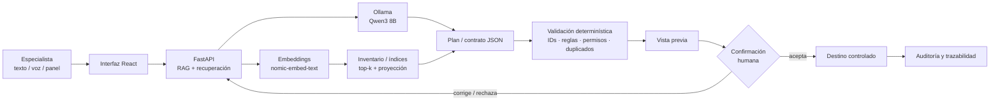
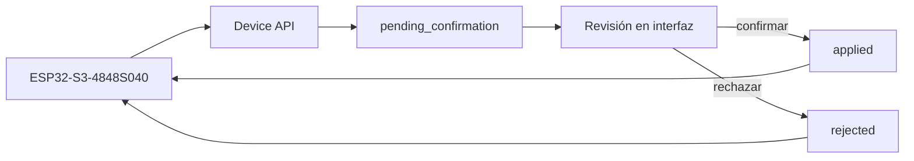
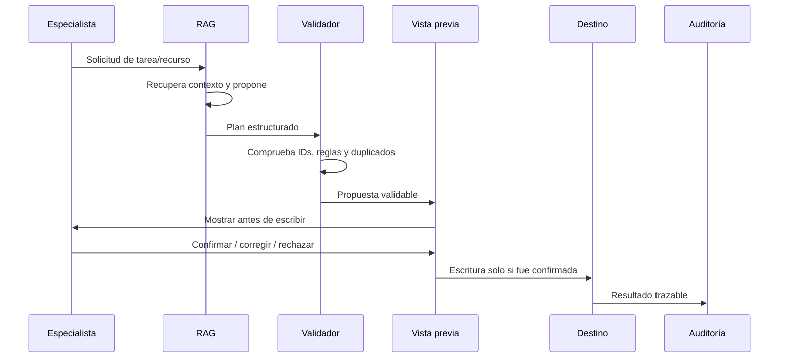

# Asistente con arquitectura RAG para carga automatizada de recursos de mantenimiento

> Repositorio de **presentación para asesoría de tesis**. Resume el problema, el funcionamiento del sistema, la arquitectura, la metodología y el estado de validación en una lectura rápida.  
> Autor: **William Alexander Polo Valerio** · Ingeniería Mecatrónica · Universidad Ricardo Palma.

## 1. Qué problema resuelve

La preparación de recursos de mantenimiento exige revisar tareas, catálogos y documentos técnicos, resolver nombres ambiguos, comprobar identificadores y trasladar el resultado a estructuras de carga. En un flujo manual pueden aparecer:

- búsquedas repetitivas y retrabajo;
- descripciones abreviadas o distintas para un mismo recurso;
- duplicados u omisiones;
- errores de transcripción;
- pérdida de trazabilidad entre la solicitud, la evidencia consultada y el registro final.

La tesis propone **asistir** este proceso sin entregar autoridad de escritura al modelo de IA.

## 2. Idea central en 30 segundos

```text
Solicitud del especialista
        ↓
Recuperación de contexto (RAG)
        ↓
IA interpreta y propone
        ↓
Contrato estructurado / plan
        ↓
Validación determinística
        ↓
Vista previa
        ↓
Confirmación humana
        ↓
Escritura autorizada + auditoría
```

**Principio de diseño:** la IA puede interpretar y recuperar; los identificadores, reglas, permisos, duplicados y operaciones de escritura se comprueban fuera del modelo.

## 3. Arquitectura completa



### Canal físico ESP32



El panel no escribe directamente en la fuente operativa: envía la solicitud y refleja el estado del flujo de revisión.

## 4. Componentes y responsabilidad

| Componente | Responsabilidad principal |
|---|---|
| React | ingreso de consulta, visualización, vista previa y revisión |
| FastAPI / Python | carga de fuentes, embeddings, recuperación, proyección y planes |
| Ollama · Qwen3 8B | interpretación y generación estructurada |
| nomic-embed-text | representación semántica de consultas y recursos |
| Backend determinístico | comprueba esquema, IDs, relaciones, permisos, duplicados e idempotencia |
| Excel / fuentes maestras | verdad operativa de identificadores y valores válidos |
| Auditoría JSONL | registra plan, evidencia, cambios, rechazo o resultado |
| Device API | integra el canal ESP32 con el mismo flujo de confirmación |
| ESP32-S3-4848S040 | interfaz física para edición/envío de órdenes y visualización de estados |

## 5. Unidad de análisis: tarea ↔ recurso

La evaluación se concentra en una relación controlada entre una tarea de mantenimiento y un recurso válido. Los nombres ayudan a interpretar, pero la decisión operativa se vincula a identificadores y catálogos autorizados.


La captura anterior se utiliza como **ejemplo de estructura**, no como resultado estadístico de la investigación.

## 6. RAG híbrido: qué significa en este proyecto

El sistema combina dos formas de resolver la solicitud:

1. **Recuperación semántica:** localiza candidatos por significado y contexto.
2. **Comprobación determinística:** valida los candidatos contra las fuentes maestras y las reglas de carga.

Una coincidencia semántica no convierte automáticamente a un candidato en un identificador válido. Si existe ambigüedad, el flujo debe solicitar precisión o detener la operación.

## 7. Flujo operativo de un caso



## 8. Hardware documentado

### Panel ESP32-S3-4848S040


El panel documentado utiliza resolución **480 × 480**, controlador de pantalla **ST7701S**, táctil **GT911**, ESP32-S3, Flash de 16 MB y PSRAM OPI. La imagen describe la configuración; por sí sola no demuestra validación física.

### Subsistemas


La separación por subsistemas permite distinguir pantalla, táctil, memoria, retroiluminación, comunicación y elementos opcionales durante la validación.

## 9. Validación: software ≠ hardware físico


La documentación mantiene niveles de evidencia separados:

| Nivel | Qué demuestra | Qué no demuestra |
|---|---|---|
| Documentación | diseño, contratos y procedimiento | operación física |
| Implementación | código y configuración presentes | resultado exitoso sin ejecutar |
| Pruebas automatizadas | comportamiento cubierto por tests | hardware conectado |
| CI/CD | compilación y pruebas ejecutadas por workflow | pantalla/táctil/USB reales |
| Validación física | comportamiento del equipo conectado | no sustituye pruebas de software |

## 10. Metodología de evaluación propuesta

- Diseño preexperimental con observaciones antes y después sobre casos apareados.
- Muestra prevista: **360 casos técnicos**.
- Verificación previa: **20 casos críticos**.
- Indicadores: tiempo, exactitud, integridad referencial, duplicados, trazabilidad y retrabajo.
- Tiempos: mediana y rango intercuartílico.
- Comparación apareada de tiempo: **Wilcoxon**.
- Retrabajo binario: **McNemar**.
- Ejecuciones frías y calientes se registran por separado cuando corresponda.

> Este repositorio de presentación distingue el **diseño de evaluación** de los resultados cuantitativos. No se atribuye una mejora porcentual si no existe medición trazable que la respalde.

## 11. Estado del proyecto para la reunión

### Documentado / implementado

- arquitectura modular y separación de responsabilidades;
- RAG local, embeddings y recuperación de inventario;
- contratos estructurados y reglas de validación;
- vista previa y confirmación humana;
- auditoría de cambios;
- integración de Device API;
- firmware e interfaz del panel ESP32;
- pruebas automatizadas y workflows de software.

### A cerrar con evidencia experimental

- matriz completa de casos con mediciones reproducibles;
- comparación manual vs. prototipo;
- resultados estadísticos definitivos;
- validación física del panel para el alcance que finalmente se acuerde;
- correspondencia final entre resultados, objetivos y conclusiones.

## 12. Ruta rápida para el asesor

Para entender el sistema sin recorrer todo el código:

1. **Problema y aporte:** este README, secciones 1–3.
2. **Funcionamiento completo:** [docs/SISTEMA_COMPLETO.md](docs/SISTEMA_COMPLETO.md).
3. **Reunión de 15 minutos:** [docs/GUIA_REUNION_15_MIN.md](docs/GUIA_REUNION_15_MIN.md).
4. **Metodología y validación:** [docs/METODOLOGIA_VALIDACION.md](docs/METODOLOGIA_VALIDACION.md).
5. **Estado y preguntas al asesor:** [docs/ESTADO_Y_PREGUNTAS.md](docs/ESTADO_Y_PREGUNTAS.md).
6. **Fuentes, commits e imágenes:** [docs/FUENTES_Y_TRAZABILIDAD.md](docs/FUENTES_Y_TRAZABILIDAD.md).

## 13. Repositorios técnicos relacionados

- **ERP / firmware / panel / validación:** [wpv10barza/erp-mantto-esp32](https://github.com/wpv10barza/erp-mantto-esp32)
- **Monitor y Device API 3C:** [wpv10barza/asistente-3c](https://github.com/wpv10barza/asistente-3c)
- **Este repositorio:** capa de presentación académica y navegación rápida para asesoría.

La implementación RAG local se describe aquí de forma académica y funcional; no se publican claves, rutas personales ni datos operativos sensibles.

---

### Tesis

**Desarrollo e implementación de una solución de inteligencia artificial mediante una arquitectura RAG híbrida para la optimización y carga automatizada de recursos de mantenimiento**

Autor: **William Alexander Polo Valerio**  
Código universitario: **201920425**  
Escuela Profesional de Ingeniería Mecatrónica · Universidad Ricardo Palma · 2026
